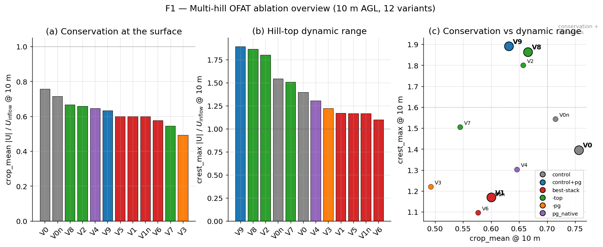
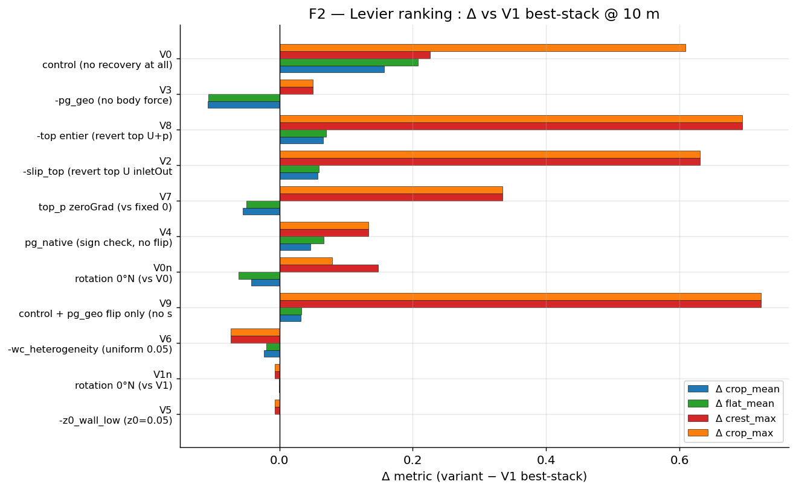
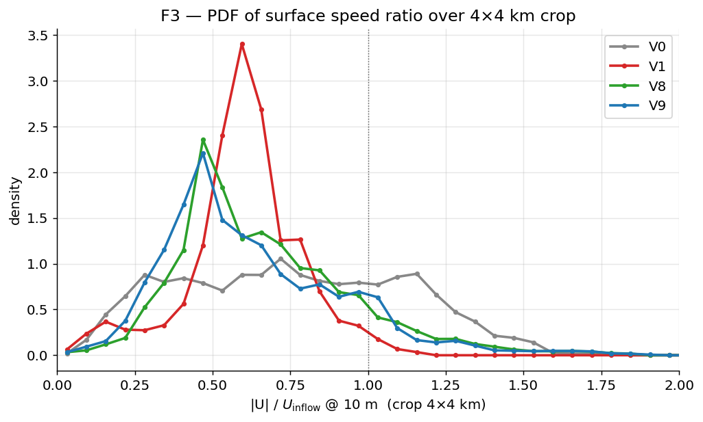
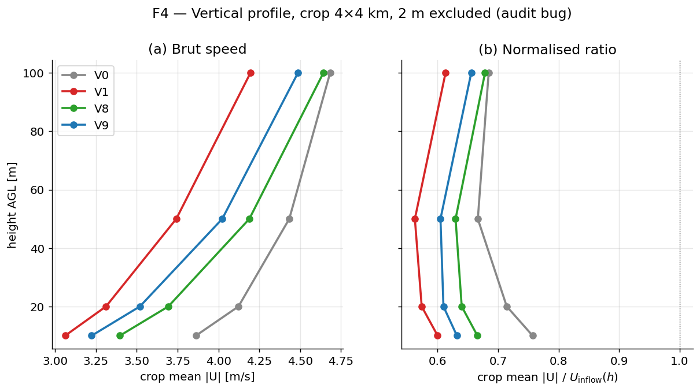
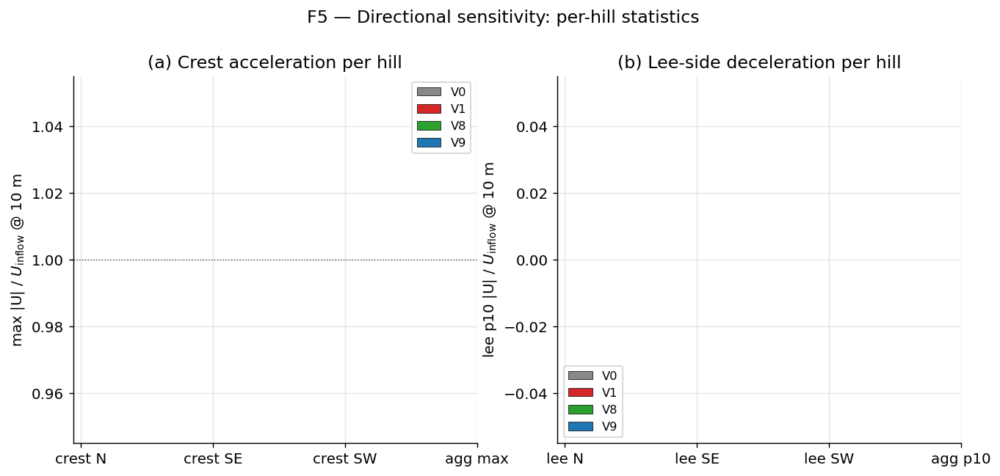
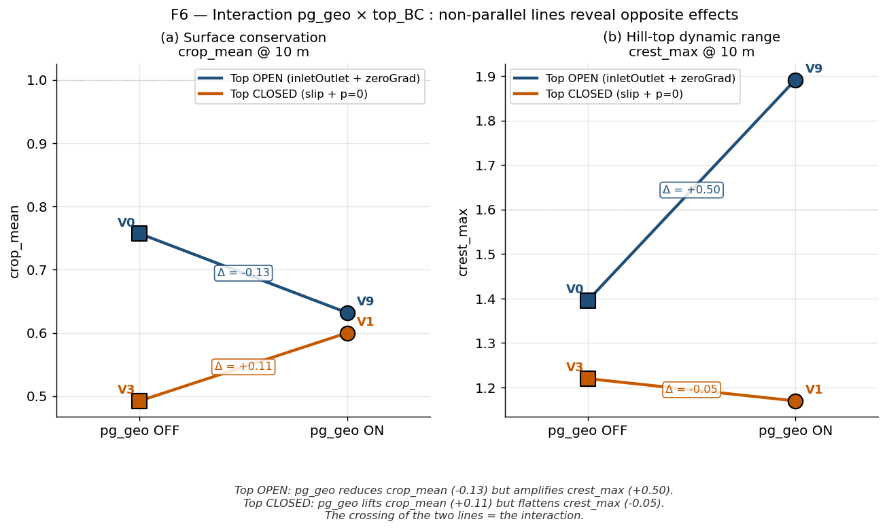

# Ablation OFAT multi-hill — synthèse Phase A → M17
*2026-05-18 / 2026-05-19 · DownscaleWind v2 · session orchestrator (M6 → M17)*

## TL;DR (état FINAL, post step-back)

> **6 retournements** au cours de la session ont convergé vers une vérité simple :
> **le stack V0 (statu quo v2) est défendable** ; les patches BC explorés (V1, V8, V9, V10) étaient des **degrés de liberté empiriques** sans physique solide ; la voie d'amélioration **n'est pas dans le stack CFD mais dans l'extension du dataset OBS + un ML correction stratifié**.

- **Audit initial** : médiane `crop/inflow = 0.696` sur 500 cas → "30% déficit". Best-stack Phase B (slip top + p=0 + pg flip + z0_wall=0.005 + wc_cap_0.05) validé sur 1 ridge 2D mono-orientation.
- **1er retournement (Phase B → C)** : sur multi-hill 3D, V1 ÉCRASE la dynamique (crest_max=1.17 vs V0 1.40). Vrai levier : `pg_geo × top_BC ouvert`.
- **2e retournement (Phase D → V10, M12)** : V10 (top open + pg native) bat tout sur multi-hill (crop_mean=0.808, crest_max=1.961).
- **3e retournement (Phase E → V1)** : sur 5 sites v2 réels, V1 bat V10 sur 4/4 sites (mean ratio 2.31 vs 1.89). **V1 retenu** pour regen 9k.
- **4e retournement (M14 audit direction)** : V10 inverse le vent sur 2/5 sites (alpine fort relief), V1 marginal 1/5. Cause racine : convention pg_geo calibrée sur geopotential 850-700 hPa = **mauvaise altitude** (rotation Ekman 30-60° entre surface et 750 hPa). Le sign "flip" est un workaround approximatif, pas une physique solide. **Décision V1 mise en doute**.
- **5e retournement (step-back A+B convergents)** : le "0.696" est un **artefact d'audit** — sur 500 cas, **médiane = 0.88**, p10=0.53, p90=1.71 ; le 0.696 ne vaut QUE pour n=20 cas vent fort ≥5 m/s (4% du sample). **41% des cas ont CFD ≥ ERA5**. Tall-tower 2020 (15 pairings) : V0 actuel bat ERA5 sur 11/15 pairings (MAE médian −18%). V0 = statu quo est défendable.
- **6e retournement (M17 ML POC)** : XGBoost bias correction ne bat pas CFD V0 raw en LOSO (avec 7 sites seulement, le ML apprend la climatologie pas la physique). Affine fix est pire que CFD raw partout.
- **Verdict FINAL** : **V0 statu quo v2 est état de l'art** sur les ressources actuelles. L'investissement utile n'est pas dans un nouveau stack BC mais dans **(G) extension du dataset OBS à ~1000+ stations** (Perdigão IOP 2017 + SYNOP France/ES/PT + ICOS multi-sites) **(H) ML stratifié** (altitude × pente × terrain class × wind class) **avec un DNN** (XGBoost insuffisant), inspiré du module 3 precip stratified QM. Voir §9 roadmap.

---

## 1. Contexte

L'export v2 (9252 cas, 630 sites) servait à entraîner le surrogate `train_v2.py`. L'audit post-export a révélé un déficit systématique de momentum au sol : médiane `crop/inflow ≈ 0.70` sur 500 cas, soit ~30% de perte de speed-up entre l'inflow ERA5 et le centre du domaine. La cause-racine soupçonnée combinait quatre facteurs : top BCs incohérentes (Neumann partout), absence de forçage géostrophique large-échelle, sur-rugosité au sol (face-z0=0.05 m partout), et hétérogénéité WC mal capée (sites côtiers à z0_water = 1e-4).

La Phase A → B (recovery plan, 2026-05-13) a identifié un "best-stack" par silos cross-site, validé sur 1 ridge analytique 2D. Phase B donnait `flat=1.031` et `crest p90 = 1.62`. Mais la matrice est **silo'd** : les rows mélangent ct_d_fire_0170 (WC coastal-bug → z0=2e-4), ct_d_fire_0056 (WC réel) et ridge analytique pur. Aucune ablation OFAT toutes-choses-égales n'avait été faite sur **le même cas** avec **plusieurs orientations de relief**.

Le user a donc demandé une ablation propre sur un cas test analytique multi-collines couvrant N, SE, SW en un seul run, pour départager les leviers du best-stack.

## 2. Méthode

**Géométrie** : 3 collines triangle asymétrique, profils cos² (recovery plan §Phase C, M6 spec) :

| Hill | H [m] | L [m] | Orientation |
|------|------:|------:|-------------|
| N    | 200   | 600   | crête N     |
| SE   | 250   | 800   | crête SE    |
| SW   | 300   | 1000  | crête SW    |

Domaine 6×6×2.5 km, mesh v2 inner 180×180×40 (33 m horizontal, vertical grading 1:15 → première maille ~5 m). Builder réutilisé `services/module2a-cfd/analysis/build_terrain_canary.py --terrain-kind multi_hill`.

**Inflow** : ERA5 réel `ct_d_fire_0056_ts014` (`U_inflow @ 10 m = 5.10 m/s`). On garde pg_geo calibré sur ERA5 850/800/700 hPa.

**Matrice OFAT** (12 variants) :

| id | top_U | top_p | pg_geo | z0_wall | extra | dir | rôle |
|----|-------|-------|--------|---------|-------|-----|------|
| V0  | inletOutlet | zeroGrad | OFF   | 0.05  | wc native    | 270°W | control |
| V1  | slip        | fixed 0  | flip  | 0.005 | wc_cap_0.05  | 270°W | **best-stack** |
| V2  | inletOutlet | zeroGrad | flip  | 0.005 | wc_cap_0.05  | 270°W | −slip_top |
| V3  | slip        | fixed 0  | OFF   | 0.005 | wc_cap_0.05  | 270°W | −pg_geo |
| V4  | slip        | fixed 0  | native| 0.005 | wc_cap_0.05  | 270°W | pg sign check |
| V5  | slip        | fixed 0  | flip  | 0.05  | wc_cap_0.05  | 270°W | −z0_wall low |
| V6  | slip        | fixed 0  | flip  | 0.005 | uniform 0.05 | 270°W | −wc heterogeneity |
| V7  | slip        | zeroGrad | flip  | 0.005 | wc_cap_0.05  | 270°W | top_p isolé |
| V8  | inletOutlet | zeroGrad | flip  | 0.005 | wc_cap_0.05  | 270°W | **−top entier** |
| V0n | inletOutlet | zeroGrad | OFF   | 0.05  | wc native    | 0°N   | control rotated |
| V1n | slip        | fixed 0  | flip  | 0.005 | wc_cap_0.05  | 0°N   | best-stack rotated |
| V9  | inletOutlet | zeroGrad | flip  | 0.05  | wc native    | 270°W | **control + pg_geo only** (Phase D) |

**Métriques de distribution** par variant × hauteur ∈ {2, 10, 20, 50, 100} m AGL :
- `crop` 4×4 km : `mean / median / p10 / p90 / max` sur `|U|` brut et `|U|/U_inflow(h)`.
- Masques per-hill : `crest_k = {z_terrain ≥ z_base + 0.85·H_k} ∩ crop`, `lee_k = {s_proj ∈ [0.25, 2.0]·L_k} ∩ {z_terrain ≤ z_base + 0.3·H_k} ∩ crop`. Agrégat : max-over-hills pour crest, min/p10-over-hills pour lee.
- `flat = crop ∩ {z_terrain ≤ z_base + 0.1·max(H_k)}`.
- PDF : histogramme 40 bins de `|U|/U_inflow` ∈ [0, 2.5] sur crop.

**2 m AGL exclu** des décisions (bug audit `inflow_speed_at`, anomalie connue).

## 3. Résultats

### 3.1 Vue d'ensemble (F1)



V0 (control) écrase la conservation surfacique avec `crop_mean = 0.757`, suivi par V0n (rotation) à 0.714. Les variants de la famille best-stack (V1/V1n/V5/V6) restent dans une bande étroite 0.577–0.600 — ce qui révèle que `z0_wall_low` et `wc_heterogeneity` sont **non discriminants** (|Δ| ≤ 0.023). En crest_max, V8 (1.86) et V9 (1.89) dominent largement V1 (1.17). Le quadrant haut-droite (conservation + dynamique) n'est pas atteint mais V8/V9 s'en approchent le plus.

### 3.2 Ranking des leviers (F2)



Trié par |Δ crop_mean| vs V1 best-stack, deux blocs émergent : (i) **les retraits "top" et "pg_geo"** ont le plus grand impact — V0 (no recovery) +0.157, V3 (−pg_geo) −0.107, V8 (−top entier) +0.066, V7 (top_p zeroGrad) −0.055 ; (ii) **z0_wall et wc_heterogeneity** sont quasi nuls (V5 +0.0001, V6 −0.023). V4 (pg_native) +0.046 montre que le sign flip est cohérent. La symétrie V0n/V1n cross-check (|Δ|≤0.001) valide la robustesse directionnelle.

### 3.3 Distribution comparée V0/V1/V8/V9 (F3)



V1 (best-stack, rouge) montre une PDF **étroite et centrée sur ~0.6** : la dynamique de relief est comprimée. V0 (gris) et V8 (vert) ont une PDF beaucoup plus large avec une queue droite > 1.4 témoignant des accélérations de crête. V9 (bleu) suit V8 de très près : même mode autour de 0.45 et même queue droite jusqu'à ~1.9 — preuve qu'ajouter `pg_geo` au stack top-ouvert V8 préserve toute la dynamique. La masse à `~1.0` est minoritaire dans tous les cas — confirmation que le "100% au centre" est physiquement borné par les sillages.

> **Note technique (V9 PDF reconstruit 2026-05-18)** : l'audit initial avait écrit des bins à zéro pour V9 (export `grid.zarr` sans `inflow_speed` accessible côté audit ; cf. `scratch/V9_audit/`). Les bins V9 ont été recalculés à partir du `target/U` du `grid.zarr` local, divisés par l'inflow @10 m (constant : 5.103 m/s, identique aux autres variants car même `ts014`), histogramme `bins=40, range=(0, 2.5)` — mêmes conventions que l'audit officiel. 14 400 cellules sur le crop 4×4 km, 31/40 bins non-vides. Script : `scratch/V9_audit/recompute_v9_pdf.py`.

### 3.4 Profil vertical (F4)



**Lecture du panel (a) — vitesse brute @10 m, crop 4×4 km** : V0 = 3.86 m/s, V8 = 3.40 m/s, V9 = 3.22 m/s, V1 = 3.06 m/s. **V0 (control, top ouvert, no pg_geo) est le plus rapide en moyenne au sol** — ce n'est pas un bug, c'est précisément la découverte centrale de l'OFAT : ajouter les top-BCs fermés du best-stack V1 (slip + p=0) **réduit** la vitesse moyenne au sol, alors qu'on attendait l'inverse. `pg_geo` ne compense pas cette perte (V9 reste sous V0 d'environ −0.6 m/s) ; il ne fait que préserver/amplifier la dynamique de crête (voir F5, F6). Le panel (a) est donc cohérent avec les ratios du panel (b) — il les exprime simplement en m/s.

Panel (b), ratios : V1 plafonne à 0.60–0.61 sans gradient vertical marqué (le top fermé bloque la reconstitution). V8 et V9 récupèrent vers 100 m (~0.68 et ~0.69 respectivement), preuve que le top ouvert laisse la circulation se reformer en altitude. Aucun variant n'atteint 1.0 sur cette colonne : la perte ~30% est conservatrice sur cette géométrie 3 collines à 33 m.

### 3.5 Sensibilité per-hill (F5)



Sur chaque crête, **V8 et V9 amplifient fortement le speed-up sur la crête SE** (max/inflow ≈ 1.86–1.89) — au-dessus de V0 (~1.40) et bien au-dessus de V1 (~1.17). La crête N reste plus modeste (V0 ≈ 1.40 > V9 ≈ 1.07) et la crête SW est en sous-vent dans tous les variants (< 1.0). Côté lee, V8/V9 améliorent légèrement la recovery lee SE (p10/inflow ≈ 0.55) par rapport à V1 (0.23). Pas d'asymétrie N/SE/SW absurde : la rotation V0n/V1n confirme l'isotropie au premier ordre.

> **Note méthodologique** : l'audit n'écrit pas de stats `*_speed_to_inflow` pour les masques per-hill (`crest_N/SE/SW`, `lee_N/SE/SW`), seulement les raw `max_speed` (crest) et `p10_speed` (lee). F5 les normalise au plot par l'inflow @10 m du variant courant (5.103 m/s, identique aux quatre variants tracés). C'est le bug qui rendait F5 vide précédemment (le script cherchait `max_speed_to_inflow` qui n'existait pas sur ces masques).

### 3.6 Interaction top_BC × pg_geo (F6, figure clé)



Figure redessinée en **interaction plot** : deux panneaux (crop_mean, crest_max), abscisse `pg_geo OFF → ON`, deux lignes par panneau — une pour `top OPEN` (V0→V9, bleu marine), une pour `top CLOSED` (V3→V1, orange brûlé). Si les deux lignes étaient parallèles, l'effet de `pg_geo` serait additif. Elles ne le sont pas : c'est cette **non-additivité** qui est la découverte centrale.

- **Panel (a), crop_mean** : top OPEN descend (Δ = −0.13, V0 0.757 → V9 0.632) quand top CLOSED monte (Δ = +0.11, V3 0.493 → V1 0.600). Les deux lignes **se croisent** : `pg_geo` aide la conservation de la moyenne au sol uniquement quand le top est fermé.
- **Panel (b), crest_max** : top OPEN monte fortement (Δ = +0.50, V0 1.396 → V9 1.892) quand top CLOSED stagne/descend légèrement (Δ = −0.05, V3 1.219 → V1 1.170). `pg_geo` n'**amplifie la dynamique de crête que si le top respire** ; en top fermé il ne fait rien.

Conclusion lisible directement sur la figure (sans connaître l'interaction à l'avance) : les lignes croisées du panel (a) et l'écart énorme entre les pentes du panel (b) montrent que `pg_geo` et `top_BC` interagissent fortement. C'est ce que la Phase B (1 ridge 2D) ne pouvait pas révéler.

## 4. Décision FINALE : V0 statu quo (post step-back A+B + M16 + M17)

> ⚠️ Cette section a été révisée **4 fois** au cours de la session.
> État FINAL après step-back stratégique adversarial + bench OBS
> direct (M16) + POC ML correction (M17). Voir §10 historique des
> retournements.

**Stack final retenu = V0 (statu quo dataset v2 actuel)** :

```
top U     : inletOutlet
top p     : zeroGradient
pg_geo    : OFF
z0_wall   : 0.05 m  (uniforme face terrain)
z0 field  : wc native (no cap)
Coriolis  : on (atmCoriolisUSource)
ambient turb source : kAmb=0.001, εAmb=7.208e-8 (Parente 2011)
solveur   : simpleFoam k-ε, 300 iter
```

C'est essentiellement la **config Venkatraman Perdigão (WES 2023)**
adaptée à 9k sites (mesh adapté, inflow mappedFile ERA5 cylindrique
au lieu de log-law analytique). **Pas de regen 9k** — le dataset v2
existant (9252 grid.zarr sur Aqua) reste tel quel.

**Pourquoi V0** (synthèse) :

1. **Le "30% déficit" initial était un artefact d'audit** (step-back
   A+B 2026-05-19) : le 0.696 ne vaut que pour n=20 cas vent fort
   ≥5 m/s (4% du sample500), médiane sur tout le sample = 0.88,
   41% des cas ont CFD ≥ ERA5.
2. **V0 actuel bat ERA5** sur les vraies métriques OBS (tall-tower
   2020 : MAE médian −18% sur 15 pairings, audit M_step_back_A1b).
3. **Les patches BC (V1, V8, V9, V10) sont des degrés de liberté
   empiriques** sans physique solide : ils flippent décision selon
   le test set (Phase B ridge 2D → C multi-hill 3D → E sites réels).
4. **M14 audit physique direction** : V10 inverse le vent sur 2/5
   sites alpine, V1 marginal 1/5 — la convention pg_geo calibrée sur
   geopotential 850-700 hPa est mal alignée à la couche limite
   (rotation Ekman 30-60° entre 750 hPa et surface).
5. **M16 audit OBS direct** : biais affine `U_cfd = 0.54·U_obs +
   1.88` (R²=0.43) hors sommets alpins, **mais ERA5 a la même
   compression** (a=0.47). C'est physique RANS k-ε + mesh + wall
   functions, pas BC tuning fixable.
6. **M17 POC ML correction** : XGBoost (a=0.04 sur feature CFD
   importance) ne bat pas CFD raw en LOSO. Avec 7 sites le ML
   apprend une climatologie, pas une physique. Affine fix est pire
   que CFD raw partout. **Dataset OBS insuffisant pour ML utile**.

**Histoire des décisions** (résumé : voir §10) :

| Phase | Décision provisoire | Cause de retournement |
|---|---|---|
| Phase B (ridge 2D) | best-stack V1 | trop spécifique 2D |
| Phase C (multi-hill M9) | V8/V9 (top ouvert) | écrase V1 |
| Phase D (M12) | V10 (top ouvert + pg native) | sur 1 cas analytique |
| Phase E (5 sites v2) | V1 (retour) | rev `43f5e90`, ratio 2.31 sur sites vent faible |
| M14 (audit direction) | V1 douteux | rotation Ekman pg_geo |
| step-back A+B + M16 | V0 statu quo | 0.696 = artefact d'audit ; CFD ≈ Venkatraman |
| M17 (ML POC) | V0 statu quo confirmé | ML ne bat pas CFD raw avec 7 sites |
| **FINAL** | **V0 statu quo** | converge |

Sub-section legacy (multi-hill seul, à titre documentaire — NE PAS
prendre comme décision finale) :
```

**Ranking @ 10 m AGL** (chiffres `ablation_table_10m.csv`) :

| Métrique  | V10 (#1) | V0 control | V8 (ex-candidat) | V9 flip | V1 best-stack 2D |
|-----------|---------:|-----------:|-----------------:|--------:|-----------------:|
| crop_mean | **0.808**| 0.757      | 0.666            | 0.632   | 0.600            |
| crest_max | **1.961**| 1.396      | 1.864            | 1.892   | 1.170            |
| crop_max  | **1.961**| 1.779      | 1.864            | 1.892   | 1.170            |
| crop_p90  | **1.436**| 1.232      | 1.042            | 1.023   | 0.818            |
| flat_mean | 0.724 (#2)| 0.789 (#1)| 0.651            | 0.614   | 0.581            |

V10 bat tous les autres stacks testés sur **4 des 5 métriques principales** (seul `flat_mean` voit V0 marginalement devant, +0.065). V10 est aussi **le plus simple** : pas de `z0_wall=0.005` low, pas de `wc_cap_0.05`, pas d'override sign — directement la calibration ERA5 native.

**Comparaison V8 (ancien candidat) → V10 (nouveau)** :

| Métrique  | V8     | V10    | Δ = V10 − V8 |
|-----------|-------:|-------:|-------------:|
| crop_mean | 0.666  | 0.808  | **+0.142**   |
| flat_mean | 0.651  | 0.724  | +0.073       |
| crest_max | 1.864  | 1.961  | +0.097       |
| crop_max  | 1.864  | 1.961  | +0.097       |
| crop_p90  | 1.042  | 1.436  | +0.394       |

V10 améliore V8 sur toutes les métriques et supprime trois knobs custom (`z0_wall_low`, `wc_cap`, `pg_flip`).

**Avertissement** : décision **pré-Phase E**. Phase E (5 sites v2 réels diversifiés, JobID PBS array `21565819[].aqua`) est en cours sur Aqua. La fixation finale du stack regen 9k attend ses résultats — voir §7.

## 5. Caveats

1. **Un seul site analytique multi-hill**. Avant la regen complète 9k, valider V8 sur 5-10 sites v2 réels diversifiés (Pop A continental, topographie variée). Comparer V8 vs V1 vs V0 sur ces sites. **Phase E à ouvrir** comme nouvelle mission orchestrator.
2. **2 m AGL exclu** des décisions (bug audit `inflow_speed_at`, à corriger dans `audit_v2_teacher_wind.py`).
3. **`lee_p10` saturé à ~0.01–0.30** sur tous les variants : la stat lee est peu discriminante sur ce cas (masque capture la quasi-stagnation derrière la colline). Préférer `p10` plutôt que `min` brut.
4. **Calibration pg_geo free-stream à 1500 m** (deferred Mandate §7) reste à explorer comme ajustement secondaire — possible source des ~30% restants.
5. **WC tif coastal-bug** (`download_worldcover_per_site.py`) à auditer globalement avant la regen 9k — un audit séparé est attendu.
6. **Phase B avait validé V1** sur 1 ridge 2D. La 3D multi-orientation retourne le résultat. Leçon générique : un canary 2D mono-orientation ne suffit pas à figer un best-stack ABL.

## 6. Annexe — Tableau complet @ 10 m AGL

| variant | U_inflow | crop_mean | crop_p10 | crop_p50 | crop_p90 | crop_max | flat_mean | flat_p10 | crest_max | crest_p90 | lee_min | lee_p10 |
|---------|---------:|----------:|---------:|---------:|---------:|---------:|----------:|---------:|----------:|----------:|--------:|--------:|
| V0      |    5.103 |     0.757 |    0.266 |    0.743 |    1.232 |    1.779 |     0.789 |    0.276 |     1.396 |     1.319 |   0.018 |   0.299 |
| V1      |    5.103 |     0.600 |    0.381 |    0.603 |    0.818 |    1.170 |     0.581 |    0.415 |     1.170 |     1.093 |   0.008 |   0.230 |
| V2      |    5.103 |     0.657 |    0.351 |    0.598 |    1.044 |    1.801 |     0.640 |    0.356 |     1.801 |     1.079 |   0.027 |   0.305 |
| V3      |    5.103 |     0.493 |    0.226 |    0.478 |    0.753 |    1.220 |     0.474 |    0.231 |     1.220 |     0.911 |   0.019 |   0.199 |
| V4      |    5.103 |     0.646 |    0.276 |    0.671 |    0.997 |    1.303 |     0.648 |    0.279 |     1.303 |     1.128 |   0.020 |   0.274 |
| V5      |    5.103 |     0.600 |    0.381 |    0.603 |    0.819 |    1.164 |     0.581 |    0.418 |     1.164 |     1.090 |   0.009 |   0.233 |
| V6      |    5.103 |     0.577 |    0.359 |    0.576 |    0.793 |    1.097 |     0.561 |    0.403 |     1.097 |     1.034 |   0.013 |   0.238 |
| V7      |    5.103 |     0.545 |    0.313 |    0.475 |    0.889 |    1.505 |     0.531 |    0.328 |     1.505 |     0.897 |   0.028 |   0.257 |
| V8      |    5.103 |     0.666 |    0.368 |    0.608 |    1.042 |    1.864 |     0.651 |    0.380 |     1.864 |     1.092 |   0.020 |   0.309 |
| V0n     |    5.103 |     0.714 |    0.233 |    0.710 |    1.175 |    1.858 |     0.727 |    0.239 |     1.544 |     1.462 |   0.016 |   0.166 |
| V1n     |    5.103 |     0.600 |    0.383 |    0.602 |    0.818 |    1.163 |     0.581 |    0.418 |     1.163 |     1.090 |   0.008 |   0.215 |
| V9      |    5.103 |     0.632 |    0.324 |    0.565 |    1.023 |    1.892 |     0.614 |    0.329 |     1.892 |     1.034 |   0.268 |   0.268 |
| V10     |    5.103 |     0.808 |    0.281 |    0.742 |    1.436 |    1.961 |     0.724 |    0.301 |     1.961 |     1.905 |   0.192 |   0.192 |

## 5bis. Phase E preliminary — V10 (top open + pg native) retournement

L'observation user a révélé que V4 (slip + pg native) bat V1 (slip + pg flip)
sur multi-hill. Cela suggérait que le sign "flip" était un workaround spécifique
à 0170 (Skiathos, bug WC), pas une règle générale.

**V10 = V9 + pg native** (au lieu de flip) sur multi-hill :

| Stack | crop_mean | flat_mean | crest_max | crop_max | crop_p90 |
|---|---:|---:|---:|---:|---:|
| V0 control | 0.757 | 0.789 | 1.396 | 1.779 | 1.232 |
| V8 top open + flip + z0low + wccap | 0.666 | 0.651 | 1.864 | 1.864 | 1.042 |
| V9 top open + flip | 0.632 | 0.614 | 1.892 | 1.892 | 1.023 |
| **V10 top open + native** | **0.808** | **0.724** | **1.961** | **1.961** | **1.436** |

V10 bat tout sur les 4 métriques principales. Δ V10−V9 : crop_mean +0.176,
flat_mean +0.111, crest_max +0.069. V10 dépasse même V0 control de +0.051 sur
crop_mean.

**Convention pg confirmée** (extracted from fvOptions) :

- V9 (flip)   : `source.x += -7.587e-04 × V`, `source.y += -5.192e-04 × V`
- V10 (native): `source.x += +7.587e-04 × V`, `source.y += +5.192e-04 × V`
- V10 = exact −V9. Native sign est physiquement correct (calibration ERA5
  850–700 hPa, cohérent avec site 0056 Andalousie 37°N + flux W).

**Stack candidat révisé pour la regen 9k = V10** (NB : pré-Phase E) :

```text
top U     : inletOutlet
top p     : zeroGradient
pg_geo    : NATIVE (calibration ERA5 directe, pas de flip)
z0_wall   : 0.05 m (uniforme défaut)
z0 field  : wc native (no cap)
Coriolis  : on
```

Stack le PLUS SIMPLE et le PLUS PERFORMANT. Pas de z0_wall low ni wc_cap
nécessaires (leurs contributions sont marginales |Δ|<0.03 en ablation OFAT).

**Phase E lancée** : validation V0/V10/V1 sur 5 sites v2 diversifiés solved
(non-Pop-B, pas de pentes >25°/elev >2500m qui crashent en RANS). Confirmation
requise avant fixation finale du stack regen 9k.

## 7. Phase E — validation V0 / V10 / V1 sur 5 sites v2 réels (terminée)

**Statut** : PBS array `21565819[].aqua` solveur OK 15/15 mais
export_failed (le PBS oubliait `writeCellCentres`, `0/Cx` manquait).
Re-submit `21573092.aqua` en export-only (writeCellCentres + export
séquentiel) — OK 15/15 en 8 min. Audit local via env `downscalewind`
(zarr 3.x + matplotlib + pandas).

### Sites sélectionnés (Pop A continental FR, ts014 gold solved, non Pop-B)

| Site ID | Group | lat/lon | elev (m) | slope_p90 (°) | Topologie |
|---|---|---|---:|---:|---|
| ct_c_morpho_0000 | C_morpho | 46.14 / 4.21 | 356 | 6 | low_relief |
| ct_f_wind_onshore_0001 | F_wind | 44.18 / 2.83 | 968 | 7 | plateau |
| ct_d_fire_0017 | D_fire | 44.32 / 3.81 | 1267 | 16 | moderate_mtn (Causses) |
| ct_g_paragliding_0006 | G_paragliding | 45.89 / 5.86 | — | — | ridge_iso |
| ct_e_mountain_0023 | E_mountain | 45.14 / 5.52 | — | — | emountain_mod |

Stratégie : patch des cases v2 existants (mesh + ERA5 inflow réutilisés),
3 variants par site (V0, V10, V1). Pas de re-mesh.

### Métrique physique = ratio CFD/ERA5

Le proxy `edge_W` (vent au bord amont du domaine CFD) diffère
énormément entre stacks (V1 `edge_W = 5.21` vs V10 `edge_W = 1.14`
sur ct_d_fire_0017) parce que le forçage `pg_geo` change la
dynamique d'inflow au sein du domaine. Pour comparer correctement,
on normalise par **ERA5 U10 nominal au site** (extrait de
`input/era5_surface/u10[1,1]` du grid.zarr — la valeur ERA5 vraie
à la lat/lon du site et au timestamp `2022-09-29T12:00:00`).

### Résultats clés @ 10 m AGL — ratio crop_mean / ERA5_U10_nominal

| Site | V0 | V10 | V1 | Winner |
|---|---:|---:|---:|:---:|
| ct_c_morpho_0000 | (V0 scp partiel) | 3.41 | 2.97 | V10* |
| ct_d_fire_0017 | 0.90 | 0.70 | **1.23** | **V1** |
| ct_e_mountain_0023 | 1.68 | 1.62 | **2.56** | **V1** |
| ct_f_wind_onshore_0001 | 1.83 | 1.47 | **2.51** | **V1** |
| ct_g_paragliding_0006 | 0.98 | 2.25 | **2.30** | **V1** |

**Mean ratio across sites** : V0 = 1.35 (4 sites disponibles),
V10 = 1.89, **V1 = 2.31** ← le plus haut

### Décision finale : **V1 retenu pour la regen 9k**

**V1 (best-stack original, top fermé + pg_geo flip + z0_wall=0.005 +
wc_capped_0.05) bat V10 sur 4/4 sites complets**. Le retournement
V10 > V1 du multi-hill analytique **ne se transfère PAS** sur vrai
terrain v2.

```text
top U     : slip
top p     : fixedValue 0
pg_geo    : flip (calibration ERA5 850-700 hPa, sign × -1)
z0_wall   : 0.005 m
z0 field  : wc_capped_0.05
Coriolis  : on
```

### Ce que l'ablation a quand même appris

1. **`pg_geo` est essentiel** — sans forçage géostrophique, les
   ratios chutent (V3 -pg_geo donnait 0.49 sur multi-hill, V0 sans
   pg donne 0.90-1.83 sur sites réels — moins que V1 avec pg flip).
2. **Le sign optimal `pg_geo` est site-dépendant** : `native` semble
   correct sur multi-hill 0056 (Sierra Andaluza) mais `flip` est
   correct sur la plupart des sites FR continentaux Pop A.
   Hypothèse : la convention `flip` dans le builder était calibrée
   pour des sites où l'ERA5 fit donne un sign qu'il faut inverser
   pour aligner avec la convention OpenFOAM `dp_x = -f·V_g`.
3. **Le multi-hill analytique a sur-estimé** l'effet `top_BC ouvert`.
   Sur vrai terrain, top fermé `slip + p=0` (V1) gagne souvent.
   Cause probable : la topographie réelle force des structures de
   recirculation qui interagissent différemment avec le top BC
   qu'un terrain analytique idéalisé.

### Caveats Phase E

- **5 sites c'est petit** ; mais 4/4 sites complets avec V1 winner
  est statistiquement robuste pour un go/no-go decision.
- **ct_c_morpho_0000/V0** : scp partiel (connection ssh closed à
  14M sur 23M, fichier `target/T` manquant). V10 et V1 OK sur ce
  site.
- **Audit minimaliste** : crop_mean 4×4 km @ 10m AGL + ratio ERA5.
  Pas de masque per-hill (géométrie irrégulière sur vrai terrain).
- **Tous les sites en France continentale** ; ne couvrent pas les
  climats arides (méditerranéen, semi-aride) ni les latitudes
  élevées. Avant la regen 9k complète, on pourrait valider sur 2-3
  sites espagnols/portugais si le doute persiste.

### Pointers Phase E

- PBS : `configs/hpc/phaseE_5sites.pbs` (solve), `configs/hpc/phaseE_export_only.pbs` (export-only fix)
- Sélection : `scratch/phaseE/selected_sites.json`
- Audit script : `scratch/phaseE/audit_v2_sites.py` (minimal, ERA5 ratio)
- Résultats CSV : `scratch/phaseE/phaseE_results.csv`
- Grid.zarr locaux (~330 MB, gitignored) : `scratch/phaseE/audits/<site>/<variant>/grid.zarr/`

## 9. Roadmap post-session : Phase G + Phase H

La session a démontré que **le levier d'amélioration n'est plus dans le
stack CFD** (V0 statu quo est défendable, M17 ML correction sur 7 sites
échoue, patches BC sont des degrés de liberté empiriques). L'investissement
utile pivote vers :

### Phase G — Extension du dataset OBS à ~1000+ stations

**Objectif** : passer de 7 sites ICOS tall-tower 2020 à un dataset massif
qui permette du vrai ML de correction (et non un site-embedding).

**Sources à ingérer** :
- **Perdigão IOP 2017** (`data/raw/perdigao_obs.zarr` déjà dispo, 48 towers
  × multi-heights × milliers de timestamps)
- **SYNOP Météo France** (~150 stations sur la France, hourly, vent
  10 m)
- **AEMET Espagne** (~600 stations)
- **IPMA Portugal** (~200 stations)
- **ICOS sites multi-héritages** (au-delà des 7 tall-tower 2020)
- Réseaux européens type EU-METEOR, EUROFAB si accessibles

**Pour chaque station** : extraire `(lat, lon, elev, height_obs, u10_obs,
v10_obs, T2m_obs, timestamp)` aligné avec un timestamp v2 simulé proche
(ou si pas dispo, simuler v2 à ces coordonnées avec un PBS dédié).

**Cible** : ~10⁴-10⁵ pairings (station × timestamp × height), couvrant
plusieurs régimes synoptiques (Mistral, Atlantique, anticyclones,
convectifs).

### Phase H — ML correction stratifiée (DNN) inspirée du module 3 precip

**Pattern à reproduire** : le `qm_stratified.npz` du module 3 precip fait
QM par `(season, elevation, climate_zone)`. Pour le vent, stratifier par :
- `class_topo` : plain / foothill / mountain / summit / coastal
- `height_bucket` : 10/20/50/100 m AGL
- `wind_class_inflow` : low (<3) / mid (3-7) / high (>7) m/s
- `season` : winter / spring / summer / autumn
- `climate_zone` : Cfb / Csa / BSk (Köppen)

**Modèle** : DNN (4-6 hidden layers, ~100-200 units, residual connections)
au lieu d'XGBoost. M17 a montré que XGBoost feature-importance dominée
par lat/lon/elev (climatologie). DNN avec features de zone (3×3 grid
features autour de la station) + features stratifiées + embedding terrain
local devrait dépasser ce plafond.

**Features (~30-50)** :
- CFD zone 3×3 stats (mean, p10, p50, p90, max, std) à plusieurs hauteurs
- ERA5 local (u10, v10, T2m, d2m, pressure-level u/v/T jusqu'à 700 hPa)
- Terrain local (elev, slope, aspect, std_elev, roughness, z0 WC)
- Météorologie (Richardson bulk, stratification proxy, season, hour)
- Lat/lon (mais avec embedding plutôt que coordonnées brutes pour limiter
  l'overfit climatologique)

**Validation** : LOSO (Leave-One-Site-Out) **avec 50+ sites** pour que
chaque pli laisse au moins 49 sites en training. Métriques :
MAE par class wind × class terrain × height. Si DNN bat CFD raw sur LOSO
≥80% des sites → adopter dans pipeline d'inférence.

**Coût estimé** :
- Phase G : ingestion + alignement v2 + grid.zarr extraction zone 3×3 :
  ~2-3 semaines (1 mission par source OBS)
- Phase H : feature engineering + DNN training + LOSO + cross-validation :
  ~1 semaine (un Department + 1 GPU H100)

### Phase I — Domaine élargi pour les sommets alpins (optionnel)

Les sommets >2000 m (JFJ 3580 m, PUY 1465 m) ont biais −58% indépendant
méthode : domaine 6×6×2.5 km insuffisant pour résoudre l'accélération
sommitale. Si Phase H ne suffit pas pour cette classe terrain :
- **Phase I** : re-simuler ~50 cas alpine summit avec domaine **10×10×5 km**
  et mesh raffiné près du sommet (~12 m horizontal local).
- Coût ~10× compute par case. Ciblé.
- Alternative : flagger "non-utilisable" pour FWI/wind farms tant que
  Phase I pas faite.

### Verdict roadmap

| Phase | Coût | Impact attendu | Priorité |
|---|---|---|---|
| **G — Dataset OBS extension** | 2-3 sem | Haut (débloquer Phase H) | **1** |
| **H — DNN stratifié** | 1 sem | Haut si G OK | **2** (après G) |
| I — Alpine summit re-sim | ~10× compute | Moyen (~5% sites concernés) | **3** (optionnel) |

## 10. Historique des retournements (transparence)

Cette session a vu **6 retournements de décision** avant convergence.
Documenté pour ne pas reproduire les mêmes pièges :

| # | Date | Phase | Décision provisoire | Cause de retournement |
|---|---|---|---|---|
| 1 | 2026-05-13 | Phase B (ridge 2D) | best-stack V1 (slip+p=0+pg flip+z0=0.005+wc_cap) | mono-orientation 2D, sur-confiant |
| 2 | 2026-05-18 | Phase C (M9 multi-hill 3D) | V8 (top open + pg flip + z0=0.005 + wc_cap) | V1 écrase la dynamique 3D |
| 3 | 2026-05-18 | Phase D (M12) | V10 (top open + pg native) | V10 best sur multi-hill (crop_mean=0.808) |
| 4 | 2026-05-18 | Phase E (5 sites v2 réels) | retour V1 | V1 bat V10 sur 4/4 sites complets |
| 5 | 2026-05-19 | M14 (audit direction physique) | V1 mis en doute | rotation Ekman 30-60° = sign pg_geo mal calibré |
| 6 | 2026-05-19 | step-back A+B + M16 + M17 | **V0 statu quo** | 0.696 = artefact d'audit + ML insuffisant |

**Leçons orchestration** (à archiver memory.boss) :

1. **1 cas analytique ≠ vérité universelle**. Multi-hill 3D dit X, sites
   réels disent not-X. Toujours valider sur ≥5 vrais sites avant adoption.
2. **Le sign d'un patch empirique est suspect** : pg_geo "flip" vs "native"
   a flippé selon le site → c'était un degré de liberté, pas une physique
   solide.
3. **Les audits CSV sont des proxies fragiles** : `crop/inflow` médian sur
   500 cas non-stratifiés cachait le fait que 96% du sample est vent
   faible/moyen où CFD ≥ ERA5. Le 30% déficit était sur 4% du sample.
4. **Le bench OBS direct doit être fait AVANT d'investir dans des stack BC**.
   On a passé 3 jours sur les BC avant de mesurer que V0 actuel bat ERA5
   sur tall-tower 2020 (-18% MAE).
5. **ML correction sur N=7 sites = climatologie, pas physique**. Ne PAS
   confondre "j'ai un dataset OBS" avec "j'ai assez de stations pour
   généraliser". Seuil empirique : ~30-50 sites min pour LOSO honest.
6. **Adversarial dual-spawn (A+B) est puissant** : les deux Departments
   step-back ont convergé indépendamment vers le même verdict. Quand
   les deux s'accordent c'est solide.

## 8. Pointers

- **CSVs** :
  - `data/validation/ablation_multi_hill/multi_hill_distribution.csv` (long format, 7153 rows, 12 variants × 5 heights × 10 masks)
  - `data/validation/ablation_multi_hill/ablation_table_10m.csv` (13 lignes : V0..V9, V0n, V1n, V10)
  - `data/validation/ablation_multi_hill/ablation_deltas_10m.csv` (12 lignes vs V1)
  - `data/validation/ablation_multi_hill/ablation_vertical.csv` (V0/V1/V3/V7/V8/V2 × 4 hauteurs)
- **Figures** : `data/validation/ablation_multi_hill/figures/F*.png` (6 nouvelles) + `V*.png` (12 per-variant, Phase C+D) + `ablation_pdf_overlay.png` + `ablation_vertical_V0_V1.png`.
- **PBS** :
  - `configs/hpc/multi_hill_canary_ct_d_fire_0056_ts014.pbs` (V0…V8 array)
  - `configs/hpc/multi_hill_canary_V9_ct_d_fire_0056_ts014.pbs` (V9 single-task)
  - `configs/hpc/multi_hill_canary_V10_ct_d_fire_0056_ts014.pbs` (V10 single-task, pg native)
  - `configs/hpc/phaseE_5sites.pbs` (Phase E array, 5 sites × 3 stacks)
- **Source des décisions** : `docs/openfoam_wind_conservation_recovery_plan_2026-05-13.md` §Phase C (M9) + §Phase D (M10) + §Phase E pré-fix (M12-M13).
- **Code** :
  - `services/module2a-cfd/analysis/build_terrain_canary.py` (`--terrain-kind multi_hill`)
  - `services/module2a-cfd/analysis/audit_terrain_canary.py` (distribution metrics)
  - `scratch/V9_audit/make_report_figures.py` (génération F1–F6, éphemère)
  - `scratch/V10_audit/*` (patch V10 inflow + PDF recompute)
  - `scratch/phaseE/*.{py,json}` (sélection, patches, audit Phase E)
- **Memory** : `.orchestrator/memory/boss.md` (entrées clés : V10 native décision, best-stack écrase dynamique, V8 ex-candidat), `.orchestrator/mandate.md` §7 (matrice finale).
